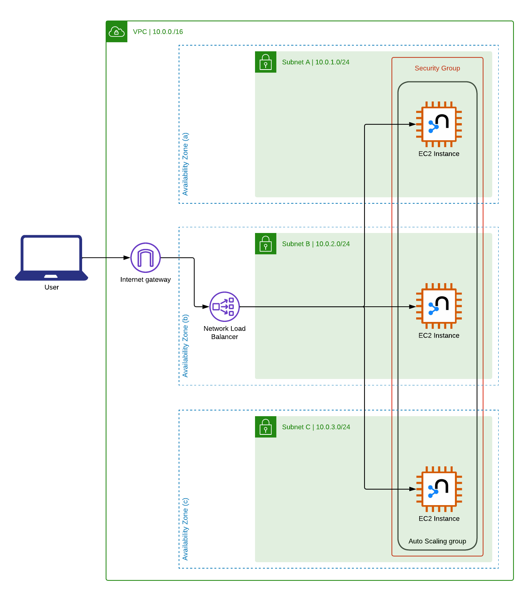

:xrefstyle: short

WARNING: This Partner Solution does not support https://docs.aws.amazon.com/vpc/latest/userguide/vpc-sharing.html[shared subnets^].

Deploying this Partner Solution with default parameters builds the following {partner-product-short-name} environment in the
AWS Cloud.

[#architecture1]
.Partner Solution architecture for {partner-product-short-name} on AWS

As shown in <<architecture1>>, the Partner Solution deploys the following cloud resources:

* A highly available architecture that spans three Availability Zones in a new virtual private cloud (VPC).
* An internet gateway
* Three public subnets (distributed across the 3 AZs), with the following address ranges:
** 10.0.1.0/24
** 10.0.2.0/24
** 10.0.3.0/24
* Security Groups
* The required Routing Tables and Subnet Associations
* 1, or between 3 and 10 EC2 instances (depending on whether a single instance, or an autonomous cluster is selected)
* 1 Network (Layer 4) Load Balancer
* An EC2 Auto Scaling Group (ASG) and associated launch configuration

* A highly available architecture that spans 1–3 Availability Zones (three shown).
* A VPC configured with private subnets, according to AWS best practices, to provide you with your own virtual network on AWS.*
* A Network Load Balancer to distribute incoming traffic to the Amazon Elastic Compute Cloud (Amazon EC2) instances in the public subnets.
* Amazon EC2 instances in an auto-scaling group in the public subnets. You have the option to deploy a single instance or an autonomous cluster of 3–10 instances (three shown).

[.small]#* By default, to give users a better experience when getting started with {partner-product-short-name}, this Partner Solution deploys in a public subnet. If you're deploying this Partner Solution in a production environment, consider using a private subnet. A private subnet limits how you access the Neo4j application and Neo4j browser over the public internet. For more information, refer to https://docs.aws.amazon.com/vpc/latest/userguide/extend-intro.html[Connect your VPC to other networks^].#