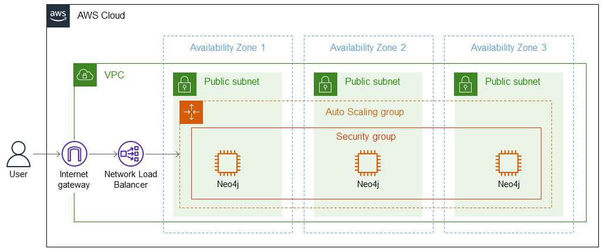

:xrefstyle: short

WARNING: This Partner Solution does not support https://docs.aws.amazon.com/vpc/latest/userguide/vpc-sharing.html[shared subnets^].

Deploying this Partner Solution with default parameters builds the following {partner-product-short-name} environment in the
AWS Cloud.

[#architecture1]
.Partner Solution architecture for {partner-product-short-name} on AWS

As shown in <<architecture1>>, the Partner Solution sets up the following:

* A highly available architecture that spans three Availability Zones.
* A VPC configured with private subnets, according to AWS best practices, to provide you with your own virtual network on AWS.*
* An internet gateway to allow the VPC to connect to the internet.
* A Network Load Balancer to distribute incoming traffic to the Amazon Elastic Compute Cloud (Amazon EC2) instances in the public subnets.
* In the public subnets, Neo4j deployed to EC2 instances in an Auto Scaling group. You have the option to deploy a single instance or an autonomous cluster of 3–10 instances (three shown).
* A security group to control access to the Neo4j instances.

[.small]#* By default, to give users a better experience when getting started with {partner-product-short-name}, this Partner Solution deploys in a public subnet. If you're deploying this Partner Solution in a production environment, consider using a private subnet. A private subnet limits how you access the Neo4j application and Neo4j browser over the public internet. For more information, refer to https://docs.aws.amazon.com/vpc/latest/userguide/extend-intro.html[Connect your VPC to other networks^].#