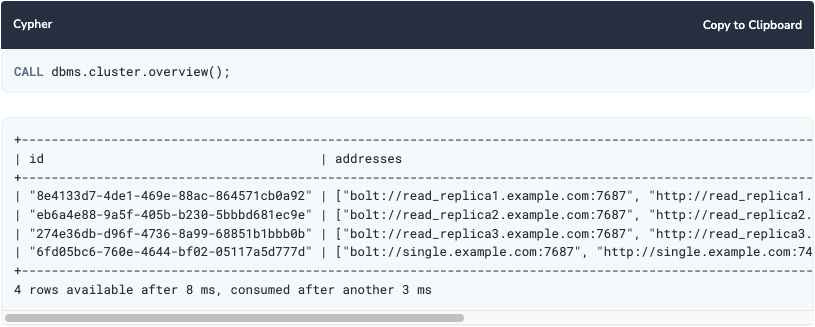
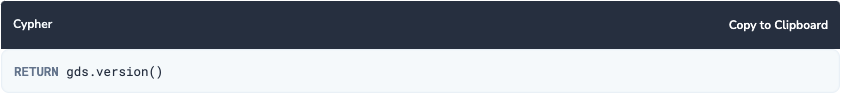

//Include any post-deployment steps here, such as steps necessary to test that the deployment was successful. If there are no post-deployment steps leave this file empty.

== Post deployment steps
. This quickstart deploys three EC2 nodes. You can connect to any of the nodes made available from EC2 console using a web browser. If a node goes down you can connect to a different node and use the web interface on that node.

. To verify that your deployment worked go to *\http://<your server>:7474* OR *\https://<your server>:7473* in your web browser and verify that you have a logon page.  *Replace your server with either the PUBLIC IP address or DNS name of your EC2 instance from AWS Console.*
+
// image::../images/neo4j_login.png[Login Page]

. You will login with the username *neo4j* and the password you supplied during the deployment. +

// image::../images/neo4j_main.png[Main Page]

=== Additional Information
//Provide any other information of interest to users, especially focusing on areas where AWS or cloud usage differs from on-premises usage.
https://neo4j.com/docs/operations-manual/4.4/configuration/ports/[Overview of the {partner-product-short-name}-specific ports].

https://neo4j.com/docs/operations-manual/current/backup-restore/planning/[Backups and restore best practices]

https://neo4j.com/docs/operations-manual/current/security/[Security best practices]

https://neo4j.com/docs/operations-manual/current/monitoring/[Monitoring best practices]

https://neo4j.com/docs/operations-manual/current/performance/[Performance best practices]

https://neo4j.com/blog/8-tips-succeeding-with-neo4j/[General best practices]

CAUTION: Note that this Quick Start deploys in the default VPC in a public subnet to give better user experience in getting started with {partner-product-short-name}. If you are deploying this Quick Start in production environment, you may want to consider using a private subnet. But that limits how you access the {partner-product-short-name} browser and driver over public internet. In that case, you need to use https://docs.aws.amazon.com/vpc/latest/userguide/vpn-connections.html[VPN] to access the {partner-product-short-name} browser and driver. If you want to see the Quick Start deployed to private subnet or other deployment model you can create feature request via github issues on the Quick Start https://github.com/{quickstart-github-org}/{quickstart-project-name}/issues/[GitHub repository^].

== Test the deployment
After connecting to any of the instances from the cluster you can run CALL dbms.cluster.overview() to check the status of the cluster. This shows information about each member of the cluster:

To verify your installation, the library version can be printed by entering into the browser in Neo4j Desktop and calling the gds.version() function:

