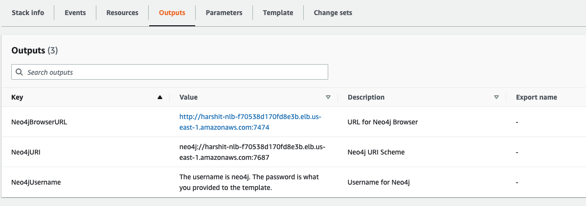
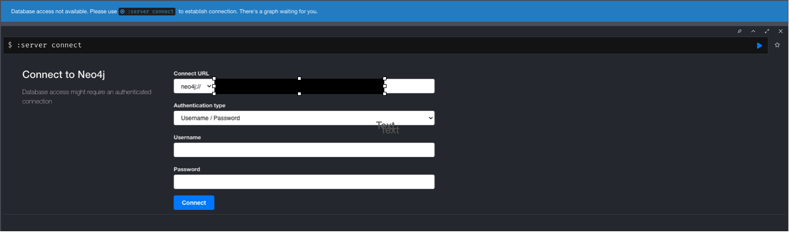
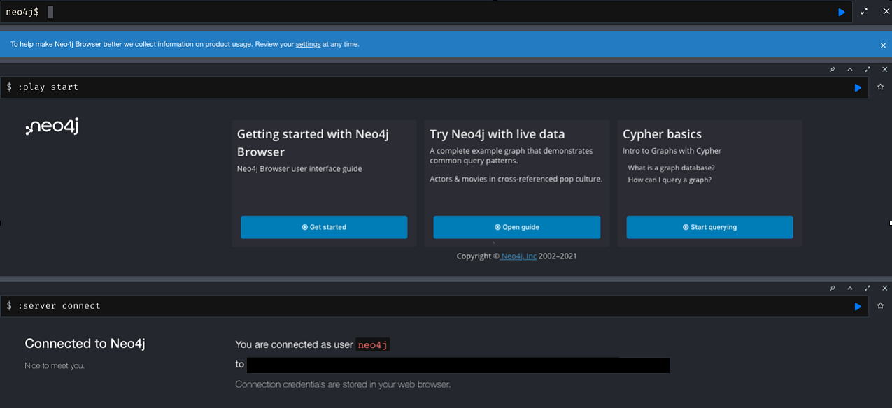
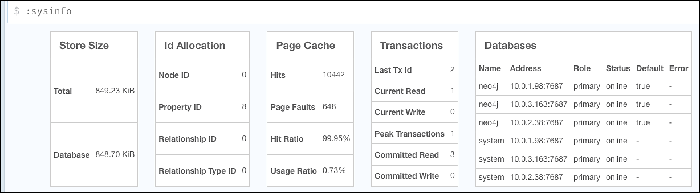

== Postdeployment steps

Test the deployment as follows:

[#neo4j-load-balancer]
. When the CloudFormation template has completed the deployment, refer to the 'Outputs' tab in the AWS CloudFormation console to obtain the URL of your Network Load Balancer and click on the link shown.  The  {partner-product-name} login page appears, as shown in <<#nlb-address>>.
+
.NLB Address

. Log in to the Neo4j application with the user name 'neo4j' and the password that you supplied during the deployment. 
+
[#neo4j-login]
.Neo4j login page

. Once you have sucessfully logged in, you will see the Neo4j main page, as shown in, as shown in <<#neo4j-main-page>>.

+
[#neo4j-main-page]
.Neo4j application main page

. Run the command ':sysinfo' to check the status of the Neo4j cluster. Information appears about each member of the cluster, as shown in <sysinfo-output>>.
+
[#sysinfo-output]
.Sysinfo Output

== Resources

* https://neo4j.com/docs/operations-manual/current/[Neo4j Operations Manual^], especially the following sections:

** https://neo4j.com/docs/operations-manual/5/configuration/ports/[Ports^]

** https://neo4j.com/docs/operations-manual/current/backup-restore/planning/[Backup and restore planning^]

** https://neo4j.com/docs/operations-manual/current/security/[Security^]

** https://neo4j.com/docs/operations-manual/current/monitoring/[Monitoring^]

** https://neo4j.com/docs/operations-manual/current/performance/[Performance^]
