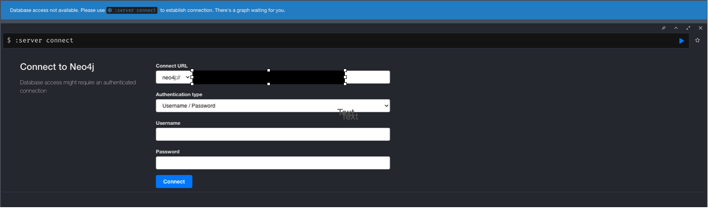
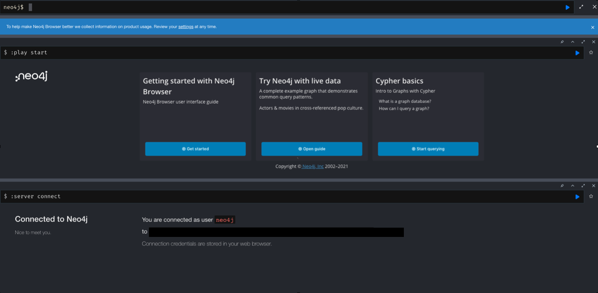
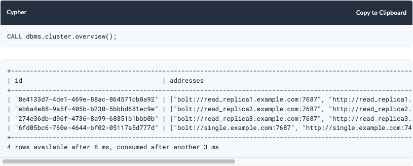
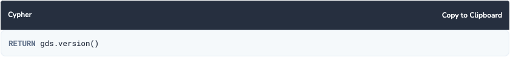

// Add steps as necessary for accessing the software, post-configuration, and testing. Don’t include full usage instructions for your software, but add links to your product documentation for that information.
//Should any sections not be applicable, remove them

== Test the deployment
To verify that your deployment worked go to *\http://<your server>:7474* OR *\https://<your server>:7473* and verify that you have a logon page.  *Replace your server with either the PUBLIC IP address or DNS name of your server.*

== Post-deployment steps
Once the stack is deployed go to *\http://<your server>:7474* OR *\https://<your server>:7473* and login with the password you provided during the deployment. *Be sure to replace your server with the PUBLIC IP address or the DNS name of your server.* +

You will login with the username *neo4j* and the password you supplied during the deployment. After you login you will see: +

This quickstart deploys three nodes.  You can connect to any of the nodes made available.  If i a node goes down you can connect to a different node and use the web interface on that node.

Once all neo4j.conf files have been configured, the instances can be started and the cluster is ready. After the cluster has started, it is possible to connect to any of the instances and run CALL dbms.cluster.overview() to check the status of the cluster. This shows information about each member of the cluster: +

To verify your installation, the library version can be printed by entering into the browser in Neo4j Desktop and calling the gds.version() function:

== Best practices for using {partner-product-short-name} on AWS
// Provide post-deployment best practices for using the technology on AWS, including considerations such as migrating data, backups, ensuring high performance, high availability, etc. Link to software documentation for detailed information.

For best practices please visit https://neo4j.com/blog/8-tips-succeeding-with-neo4j/

== Other useful information
//Provide any other information of interest to users, especially focusing on areas where AWS or cloud usage differs from on-premises usage.

This quickstart creates a security group with the following ports open: +
Port 22:  SSH +
Port 7474:  HTTP +
Port 7473:  HTTPS +
Port 7687:  Bolt +
Port 5000:  Causal Cluster discovery management +
Port 6000:  Causal Cluster transaction +
Port 7000:  Causal Cluster RAFT +
Port 7688:  Causal Cluster routing connector +
Port 2003:  Graphite monitoring +
Port 2004:  Prometheus monitoring +
Port 3637:  JMX monitoring +
Port 5005:  Remote debugging

